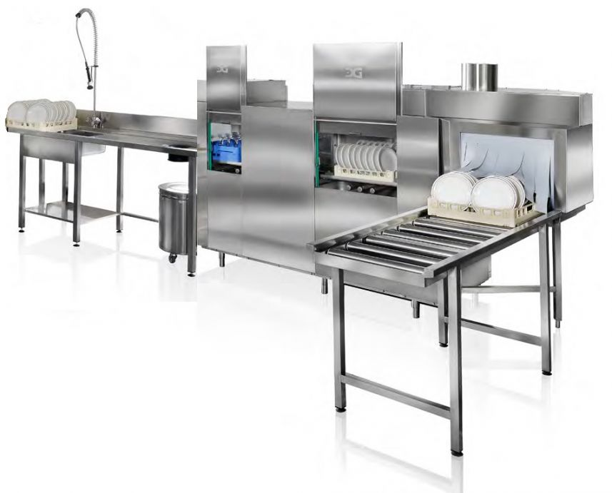
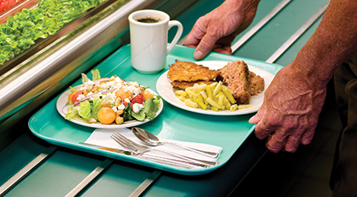
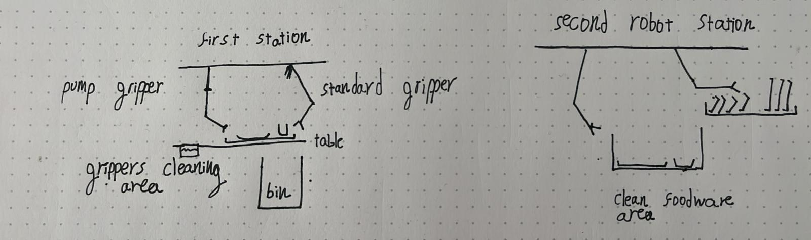
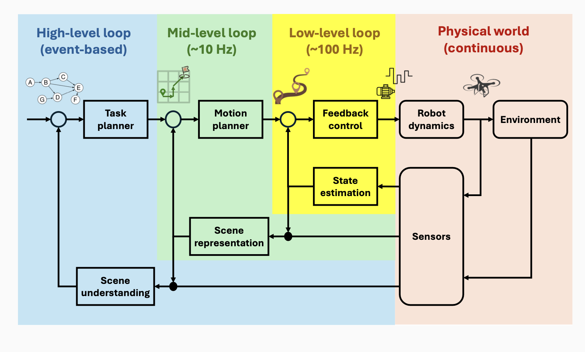

# problem definition
## motivation
when i was in boarding school there was a food hall, and at the end of each meal you had to load a conveyor belt connected to a dishwasher and two other students had an hour shift of sorting the foodware after it passes through the dishwasher.

here is an illustration of a similair dishwasher that inspired this project


## task description
students put their trays with the foodware on a table and robots will do the following for each item to replace the students
1. remove large pieces of food from it
2. load the foodware onto the conveyor belt to the dishwasher
3. at the end of the conveyor belt offload the item to the correct stack depending on the type of foodware*

*the types of foodware are tray, plate, bowl, cup, fork, spoon, and knife.

a tray


## implementation strategy
to replace the students we need robots at two stations, one to replace the students at tasks 1, 2, and another to replace the students at task 3.

here are the two robots

for both of them we'll use a Layered Control Architecture (LCA)


## expected challenges
the challenge
- although the task is mostly automated, there still will be some manual intervention required for things such as waste disposal, and picking up the clean items. that means that the robots will have some interaction with unpredictable humans.
- there was high variance in the amount of work, thats to say the amount of students finishing to eat is inconsistent, there can be 12 trays a minute which can be a lot of work.
- there would be food on the surface of the foodware, which can create a challenge for the robots in the pick up stage.

how we will address these challenges
- for some parts such as picking up the clean items the human can wait for the robot to move, and the robot can replan it's movement when it sees it surroundings change. for other parts such as waste disposal, we'll add a pause button.
- we can have more than one robot at each station to handle the extra work.
- we can choose a gripper that can grip in many different ways to minimize the chance of having to pick up in a dirty surface, have a place to clean the gripper. we can also have a small hose to clean a place to grip.

# technical documentation
each stage of the technical documentation we'll do the for both robots.
we'll use RRT* for motion planning.

## task planning breakdown
first robot - let's break down stages 1, and 2.
1. choose which of the foodware it can pick up.
2. pick it up.
3. decide there is a need to remove food from it's surface, if so, use the hose to remove the food.
4. put on conveyor belt
5. clean the gripper using the hose

second robot - now let's break down stage 3
1. choose which of the foodware it can pick up.
2. pick it up.
3. put it in the right stack

## algorithm descriptions
choosing which foodware to pick up
input: depth image of the environment
output: segmentation of the foodware, it's type, and position

cleaning foodware
input: an image of the foodware, and the depth image of the environment
output: a boolean value if the foodware is clean, and if not where to hose it

picking up foodware
input: the type of the foodware, position, a segmentation of the foodware in a image, and the depth image of the environment
output: the movement sequence to pick up the foodware

putting the foodware on the conveyor belt
input: the type of the foodware, and a depth image of the environment
output: the movement sequence to put the foodware on the conveyor belt

# implementation
## working code or pseudo code
let's describe the task planning
robot 1
```
while Active:
  depth_image = get_depth_image()
  segmentation, type, position = choose_foodware(depth_image)

  while not is_grasping:
    movement_sequence = pick_up_foodware(segmentation, type, position, depth_image)
    is_grasping = pick_up(movement_sequence)

  if is_dirty:
    while not is_clean:
      hose_position = clean_foodware(segmentation, depth_image)
      is_clean = hose(hose_position)

  while not is_on_conveyor_belt:
    movement_sequence = put_on_conveyor_belt(segmentation, depth_image)
    is_on_conveyor_belt = put_on_conveyor_belt(movement_sequence)

  while not gripper_is_clean:
    gripper_position = get_gripper_position()
    gripper_is_clean = hose(gripper_position)
```

robot 2
```
while Active:
  depth_image = get_depth_image()
  segmentation, type, position = choose_foodware(depth_image)

  while not is_grasping:
    movement_sequence = pick_up_foodware(segmentation, type, position, depth_image)
    is_grasping = pick_up(movement_sequence)

  stack_location = determine_stack_location(type)

  while not is_in_stack:
    movement_sequence = put_in_stack(segmentation, type, stack_location, depth_image)
    is_in_stack = place_in_stack(movement_sequence)
```

Let's implement the algorithms described earlier:
choosing which foodware to pick up
```
1. segment and classify the foodwares
2. choose the one that is easiest to pick up
```

cleaning foodware
```
1. determine if the foodware is dirty
2. if it is, point the hose at it and activate the hose for a few seconds
```

picking up foodware
```
1. find the grasp points
2. sort them by accessibility
3. plan a path to the grasp position
4. grasp the foodware
```

putting foodware on conveyor belt or stack
```
1. find the location of the conveyor belt or stack
2. plan a path to the location
3. ungrasp the foodware
```

## Error handling
the error handling would be the constant monitoring to determine what is our state, and replan what the robot should do. for extreme cases we have a pause button.

## success criteria
the robot is successful if
- it can handle a tray in under 10 seconds
- it for 99% of the time it doesn't need an intervention from a human
- the foodware ends up clean, and sorted
- it doesn't harm the people around it
